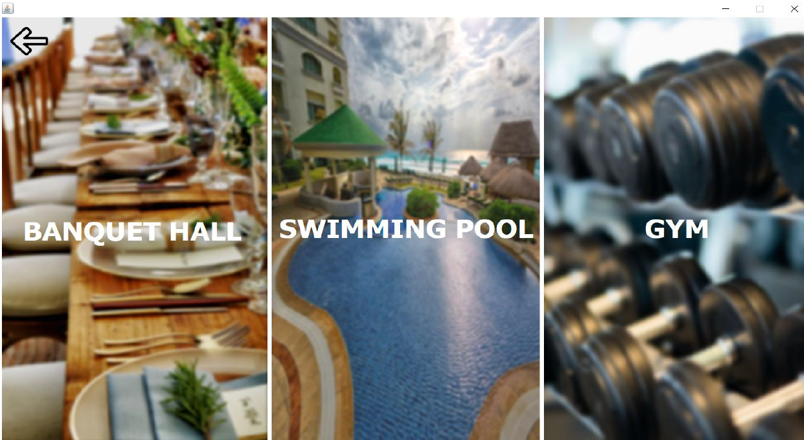

# Residential-Management-System
The Residential Management application aims to achieve some basic features for residents, tenants and colony administration in one place which will increase efficiency and transparency in all aspects of community management for a colony, flats or gated community. This project includes features such as:

<b>1. Bill Payment: </b>Easy payment options of maintenance and utility dues and bills from the apllication. 
<b>2. Facility and Activities:</b> Book and pay for facilities like Swimming Pool, Club House and Gym and participate in many activities. 
<b>3. Effective communication between Residents and Admins: </b>Community communication for residents such as problem addressing system, helpdesk. The various Contact details are also available to the user as directory. 
<b>4. Visitor Management: </b>Manage visitors entering and leaving the Society by the Admin. 

This project was built using Java Netbeans 8.1 running on Java JDK 8.0 and MySQL 5.7

## How it Works!

### 1. A Resident logs in:
The residents are initially needs to create an account by providing all the details during signup. Once the resident logs in, he/she is directed to home page. The home page contains four sections- Bill payment, clubhouse, help desk and account settings. In bill payment section, the user can view, pay and manage bills. The bills table is used here for this purpose. The clubhouse section includes three facilities namely banquet hall, swimming and gym. The resident can book the banquet hall on the specific day by choosing the free dates available. He/she can apply for gym or swimming services by choosing specific plans provided. The bills will be generated forthe facility availed by the user. A trigger is used here to insert into the bills table. The help desk section provides access to the phone directory and the residents can post their problems related to society or any facility. The admin takes care of the problems raised. The account settings section contains the account details of the resident where he can view and edit any of his details.

### 2. Admin logs in:
The admin will be provided with the login credentials with which he/she logs into the application. Once the admin logs in, he/she will be directed to home page. The homepage contains four sections namely- Bill management, facilities, help desk and visitors management. In bill management section, the admin can add, view and sort bills of the residents. The bills table is used for this purpose. In the facilities section, the admin can get the information about the facilities and schedule activities. In help desk section, the admin can view the problems raised by the residents and provide the solutions to their problems. In the visitor management section, the admin gets the data of all the visitors arriving and leaving the place along with name and other details.

## Screenshots
### 1. Admin Homepage
 

### 2. User Homepage
 

### 3. Facilities
 

### 4. Admin's Add bill page
 

### 5. Admin's View bill page
 

### 6. User's Bill payment page
 

### 7. Admin's Visitor Management page
 
